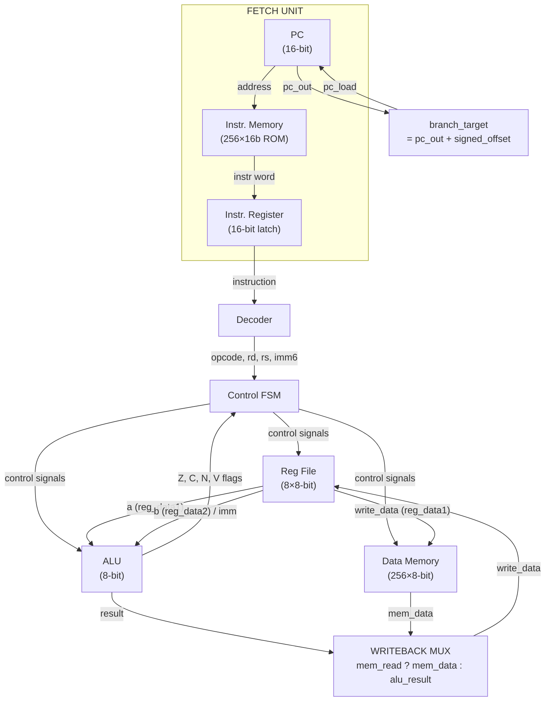

# CPU Architecture Specification

**Version:** v0.3 — Multi-cycle Branching + Memory Support  
**Date:** 2026-02-25  
**Status:** Active Development

---

## 1. Overview

| Property            | Value                          |
| ------------------- | ------------------------------ |
| Datapath width      | 8-bit                          |
| Address bus         | 16-bit                         |
| Memory architecture | Harvard (separate IMEM / DMEM) |
| Execution model     | Multi-cycle FSM                |
| ISA style           | RISC-style, load/store         |
| Register count      | 8 general-purpose (R0–R7)      |
| Instruction width   | 16-bit fixed                   |

---

## 2. Register Set

| Register | Width  | Purpose                                           |
| -------- | ------ | ------------------------------------------------- |
| R0–R7    | 8-bit  | General-purpose                                   |
| PC       | 16-bit | Program Counter — synchronous reset, load, +1 inc |
| IR       | 16-bit | Instruction Register — latches on FETCH edge      |
| MAR      | 16-bit | Memory Address Register (reserved, not yet wired) |
| MDR      | 8-bit  | Memory Data Register (reserved, not yet wired)    |
| SP       | 16-bit | Stack Pointer (reserved, not yet implemented)     |
| FLAGS    | 4-bit  | Z, C, N, V — set by ALU on arithmetic/branch ops  |

---

## 3. Flag Definitions

| Flag | Bit | Condition                                            |
| ---- | --- | ---------------------------------------------------- |
| Z    | 0   | Zero: result == 0                                    |
| C    | 1   | Carry / Borrow: 9th bit of 8-bit ALU result          |
| N    | 2   | Negative: result[7] (MSB set in two's complement)    |
| V    | 3   | Overflow: signed overflow per two's complement rules |

**ALU flag rules:**

- ADD / ADDI: all four flags set
- SUB: all four flags set; used internally for all branch comparisons
- AND / OR / XOR: Z and N updated; C = 0, V = 0
- MOV: Z and N updated; C = 0, V = 0

---

## 4. Instruction Encoding

```
Bit field:  [15:12]   [11:9]   [8:6]   [5:0]
            opcode    rd       rs      imm6
```

- **opcode** — 4-bit operation code
- **rd** — 3-bit destination register index
- **rs** — 3-bit source register index
- **imm6** — 6-bit immediate; sign-extended to 16 bits for branch targets,
  sign-extended to 8 bits for ADDI; zero-extended for LOAD/STORE addressing

---

## 5. Instruction Set Architecture — v1.0 (Implemented)

### 5.1 Opcode Encoding Table

| Opcode (bin) | Opcode (hex) | Mnemonic | Description                        |
| :----------: | :----------: | -------- | ---------------------------------- |
|     0000     |     0x0      | NOP      | No operation                       |
|     0001     |     0x1      | ADD      | Rd ← Rd + Rs                       |
|     0010     |     0x2      | SUB      | Rd ← Rd − Rs                       |
|     0011     |     0x3      | AND      | Rd ← Rd & Rs                       |
|     0100     |     0x4      | OR       | Rd ← Rd \| Rs                      |
|     0101     |     0x5      | XOR      | Rd ← Rd ^ Rs                       |
|     0110     |     0x6      | LOAD     | Rd ← MEM[ zero_ext(imm6) ]         |
|     0111     |     0x7      | STORE    | MEM[ zero_ext(imm6) ] ← Rd         |
|     1000     |     0x8      | MOV      | Rd ← Rs                            |
|     1001     |     0x9      | ADDI     | Rd ← Rd + sign_ext(imm6)           |
|     1010     |     0xA      | JMP      | PC ← sign_ext(imm6) (absolute)     |
|     1011     |     0xB      | BEQ      | if Z=1: PC ← PC + sign_ext(imm6)   |
|     1100     |     0xC      | BNE      | if Z=0: PC ← PC + sign_ext(imm6)   |
|     1101     |     0xD      | BLT      | if N⊕V=1: PC ← PC + sign_ext(imm6) |
|     1110     |     0xE      | (rsvd)   | Reserved — not implemented         |
|     1111     |     0xF      | (rsvd)   | Reserved — not implemented         |

> **Explicitly NOT implemented in v0.3:** PUSH, POP, CALL, RET, BGE, BGT, BLE.
> These are reserved for a future ISA version.

---

### 5.2 Instruction Semantics

#### 5.2.1 Arithmetic (ADD, SUB, AND, OR, XOR)

```
Rd ← Rd op Rs
```

All arithmetic instructions update FLAGS. Register `rd` is both the first source operand and the write destination.

#### 5.2.2 ADDI

```
Rd ← Rd + SignExt(imm6)
SignExt(imm6) = {{2{imm6[5]}}, imm6}   // 8-bit sign extension
```

Supports negative immediates via two's complement imm6. Range: −32 to +31.

#### 5.2.3 MOV

```
Rd ← Rs
```

imm6 field is ignored.

#### 5.2.4 LOAD / STORE (Absolute Addressing)

```
LOAD:   Rd ← DataMEM[ {2'b00, imm6} ]
STORE:  DataMEM[ {2'b00, imm6} ] ← Rd
```

Addressing mode: zero-extended imm6 → 8-bit absolute address into 256-byte data memory. No register-indirect mode in v0.3.

#### 5.2.5 JMP

```
PC ← SignExt(imm6)   // absolute jump; imm6 treated as target address
```

> Note: JMP range limited to 6-bit (0–63 or −32 to +31 signed). Planned extension via wider immediate or register-indirect in v1.0 freeze.

#### 5.2.6 Branch Instructions

**BEQ** — Branch if Equal

```
if (Rd − Rs) == 0 → Z=1:
    PC ← PC_fetch + SignExt(imm6)
```

**BNE** — Branch if Not Equal

```
if (Rd − Rs) ≠ 0 → Z=0:
    PC ← PC_fetch + SignExt(imm6)
```

**BLT** — Branch if Less Than (signed)

```
if (Rd − Rs) < 0 (signed) → N ⊕ V = 1:
    PC ← PC_fetch + SignExt(imm6)
```

Signed comparison uses the subtraction result from the ALU's SUB operation during EXECUTE. The BLT condition follows standard signed arithmetic: `negative XOR overflow`.

**Branch timing:**

- PC increments to PC+1 during **FETCH** (via `pc_enable`).
- Branch comparison executes during **EXECUTE**.
- `pc_load` asserted during **WRITEBACK** if branch condition holds.
- Branch target = `pc_out` (already incremented) + `SignExt(imm6)`.

**Signed offset:**

```
signed_offset[15:0] = {{10{imm6[5]}}, imm6}
branch_target       = pc_out + signed_offset
```

Range: −32 to +31 instructions relative to the instruction following the branch.

---

## 6. Memory Architecture

### 6.1 Instruction Memory (ROM)

| Property      | Value               |
| ------------- | ------------------- |
| Width         | 16-bit per word     |
| Depth         | 256 words           |
| Address input | PC[7:0] (lower 8)   |
| Read mode     | Asynchronous        |
| Write         | Not supported (ROM) |

### 6.2 Data Memory (RAM)

| Property      | Value                           |
| ------------- | ------------------------------- |
| Width         | 8-bit per byte                  |
| Depth         | 256 bytes                       |
| Address input | {2'b00, imm6} — 8-bit absolute  |
| Read mode     | Synchronous (registered output) |
| Write mode    | Synchronous                     |

LOAD requires two cycles due to registered read: `mem_read` is asserted in EXECUTE and again in WRITEBACK; `read_data` is valid in WRITEBACK.

---

## 7. Multi-Cycle FSM

### 7.1 State Encoding

| State     | Encoding | Description                           |
| --------- | :------: | ------------------------------------- |
| FETCH     |  2'b00   | PC++, IR ← IMEM[PC]                   |
| DECODE    |  2'b01   | Combinational decode, no side-effects |
| EXECUTE   |  2'b10   | ALU operates; LOAD initiates mem_read |
| WRITEBACK |  2'b11   | Register write / branch / store       |

### 7.2 State Transition Table

```
FETCH → DECODE → EXECUTE → WRITEBACK → FETCH (unconditional, every 4 cycles)
```

No conditional state transitions exist in v0.3. All instructions consume exactly 4 clock cycles.

### 7.3 Control Signal Truth Table

| Instruction Class  | FETCH          | DECODE | EXECUTE            | WRITEBACK               |
| ------------------ | -------------- | ------ | ------------------ | ----------------------- |
| NOP                | pc_en, ir_load | —      | —                  | —                       |
| ADD/SUB/AND/OR/XOR | pc_en, ir_load | —      | alu_op, alu_src=0  | reg_write=1             |
| ADDI               | pc_en, ir_load | —      | alu_op=ADDI, src=1 | reg_write=1             |
| MOV                | pc_en, ir_load | —      | alu_op=MOV         | reg_write=1             |
| LOAD               | pc_en, ir_load | —      | mem_read=1         | mem_read=1, reg_write=1 |
| STORE              | pc_en, ir_load | —      | —                  | mem_write=1             |
| JMP                | pc_en, ir_load | —      | —                  | pc_load=1               |
| BEQ                | pc_en, ir_load | —      | alu_op=SUB         | pc_load=1 if Z=1        |
| BNE                | pc_en, ir_load | —      | alu_op=SUB         | pc_load=1 if Z=0        |
| BLT                | pc_en, ir_load | —      | alu_op=SUB         | pc_load=1 if N⊕V=1      |

---

## 8. CPU Datapath



---

## 9. Branching — Detailed Timing

```
Cycle 0 (FETCH):
  PC → IMEM → IR
  PC ← PC + 1          ← PC is now pointing at instruction AFTER branch

Cycle 1 (DECODE):
  opcode, rd, rs, imm6 decoded (combinational)

Cycle 2 (EXECUTE):
  ALU performs Rd − Rs (SUB)
  Flags Z, N, V, C updated

Cycle 3 (WRITEBACK):
  if branch_condition:
      pc_load = 1
      PC ← pc_out + signed_offset
      (pc_out is already PC+1 from FETCH)
  else:
      PC unchanged (already at PC+1, next sequential instruction)
```

---

## 10. Signed Offset Encoding Reference

| Decimal offset | 6-bit two's complement | Notes                     |
| :------------: | :--------------------: | ------------------------- |
|      +31       |         011111         | Maximum forward branch    |
|       +1       |         000001         |                           |
|       0        |         000000         | Branch to self (BEQ loop) |
|       −1       |         111111         | Back 1 (to branch itself) |
|       −2       |         111110         | Back 2 instructions       |
|      −32       |         100000         | Maximum backward branch   |

---

## 11. BLT Signed Comparison Proof

For 8-bit signed subtraction `a − b` where a = Rd, b = Rs:

```
result[7:0] = a − b  (8-bit)
N = result[7]        (1 if result is negative in two's complement)
V = (a[7] != b[7]) && (result[7] != a[7])   (signed overflow)

Case 1: No overflow (V=0)
  a < b (signed) ↔ (a − b) < 0 ↔ N = 1 ↔ N ⊕ V = 1 ✓

Case 2: Overflow (V=1)
  Overflow flips the sign of the result.
  a < b (signed) ↔ N = 0 (result wrapped to positive)
                 ↔ N ⊕ V = 0 ⊕ 1 = 1 ✓
  a ≥ b (signed) ↔ N = 1 (result wrapped to negative)
                 ↔ N ⊕ V = 1 ⊕ 1 = 0 ✓

Therefore: a < b (signed) ↔ N ⊕ V = 1   □
```

---

## 12. Current Implementation Status

### 12.1 Implemented (v0.3)

- Multi-cycle FSM: FETCH → DECODE → EXECUTE → WRITEBACK
- 8 × 8-bit general-purpose registers (R0–R7)
- 16-bit PC, IR
- Arithmetic: ADD, SUB, AND, OR, XOR, ADDI (signed immediate)
- MOV
- Branch: BEQ, BNE, BLT (signed, relative)
- JMP (absolute, imm6-limited range)
- LOAD / STORE (absolute imm6 addressing)
- Harvard memory model: 256-word ROM + 256-byte RAM
- ALU flags: Z, C, N, V
- Signed branch offset (6-bit sign-extended to 16-bit)
- ADDI sign-extended immediate (6-bit → 8-bit)

### 12.2 Planned (v1.0 Freeze)

- Assembler (Python, two-pass, label resolution)
- Debug bus (PC, IR, FSM state, register snapshot, flags)
- Verilator-based C++ simulation wrapper
- Register-indirect addressing for LOAD/STORE
- Wider JMP target (register-based or 12-bit immediate)

### 12.3 Not Yet Implemented

- PUSH, POP, CALL, RET (stack operations — require SP integration)
- BGE, BGT, BLE branch variants
- Interrupt / exception handling
- Multiply / divide
- Shift / rotate operations
- Pipeline stages (planned post-v1.0)

---

## 13. Future Pipelining Architecture

When transitioning from multi-cycle to pipelined:

**Pipeline stages (planned 4-stage):**

```
IF  → ID  → EX  → WB
```

**Hazard classes to resolve:**

| Hazard type         | Example                                       | Mitigation                                 |
| ------------------- | --------------------------------------------- | ------------------------------------------ |
| RAW (data)          | ADDI R1 followed immediately by ADD R2, R1    | Forwarding or stall insertion              |
| Control (branch)    | BEQ followed by instructions in branch shadow | Flush or branch prediction                 |
| Structural (memory) | Simultaneous LOAD and FETCH                   | Separate IMEM / DMEM (Harvard) solves this |

Harvard architecture eliminates structural hazards between fetch and data memory access, giving the pipelined version a significant advantage.

**Signal changes required for pipelining:**

- Pipeline registers between each stage (IF/ID, ID/EX, EX/WB)
- Forwarding unit for ALU → ALU and MEM → ALU paths
- Hazard detection unit for load-use stalls
- Branch resolution moved to EX stage with 1-cycle penalty or branch predictor

The debug bus interface (Section 14) is designed to be pipeline-stage-aware for future use.

---

## 14. Debug Bus Interface (Planned v0.4)

To support Verilator-based simulation and FPGA JTAG integration, the following debug bus will be added to `cpu_core`:

```verilog
// Debug bus outputs (non-intrusive, read-only)
output [15:0] dbg_pc,
output [15:0] dbg_ir,
output [1:0]  dbg_state,
output [63:0] dbg_regfile,   // R7..R0 packed, 8-bit each
output [3:0]  dbg_flags,     // V, N, C, Z
input         dbg_en,        // enable debug output
input         dbg_step       // single-step mode (halts after WB)
```

---

_End of Specification_
